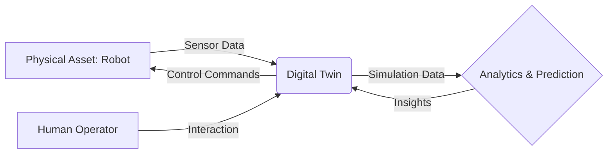

# Digital Twin Concept Diagram

```mermaid
graph LR
    A[Physical Asset: Robot] -- Sensor Data --> B(Digital Twin)
    B -- Control Commands --> A
    B -- Simulation Data --> C{Analytics & Prediction}
    C -- Insights --> B
    D[Human Operator] -- Interaction --> B
```
