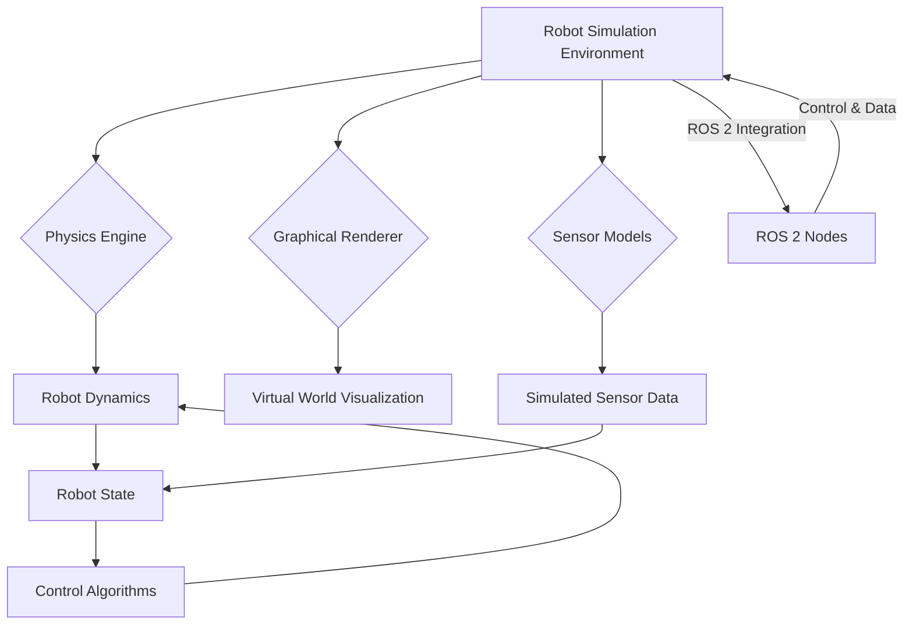

```mermaid
graph TD
    A[Robot Simulation Environment] --> B{Physics Engine};
    A --> C{Graphical Renderer};
    A --> D{Sensor Models};
    B --> E[Robot Dynamics];
    C --> F[Virtual World Visualization];
    D --> G[Simulated Sensor Data];
    E --> H[Robot State];
    G --> H;
    H --> I[Control Algorithms];
    I --> E;
    A -- ROS 2 Integration --> J[ROS 2 Nodes];
    J -- Control & Data --> A;
```